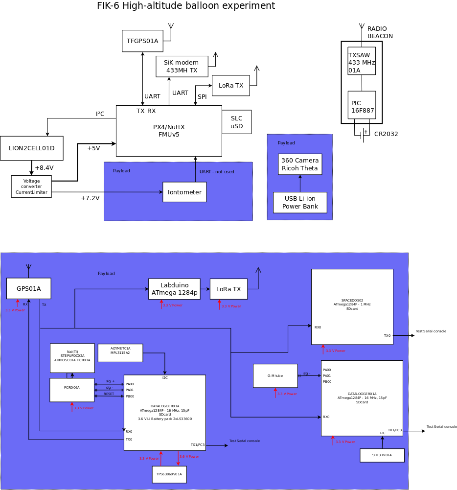

# FIK-8
[Department of Radiation Dosimetry of the Nuclear Physics Institute of the Czech Academy of Sciences](http://www.ujf.cas.cz/en/departments/department-of-radiation-dosimetry/contact/) high-altitude balloon experiment

### Scientific payload

  * PiTED
  * SPACEDOS dosimeters
  * THUNDERMILL01

### Supporting instruments

  * Relative humidity sensor (THUNDERMILL01)
  * Temperature sensor (THUNDERMILL01)
  * Precise barometer
  * Spheric (360 deg) camera

### Design features

  * Redundant telemetry link
  * Gondola orientation tracking and logging
  * Realiable IMU sensor processing and caliblation
  * Possible of use relative high-power payloads
  * Pre-flight continuous charging possible
  * Power monitoring and maximal uptime calculation relevant to actual temperature

### Flight data

 The more detailed description of the flight and discussion of experiment is included in [EURADOS presentation](doc/FIK-6_EURADOS_presentation.pdf)

### Links

  * [Facebook](https://www.facebook.com/balonfik/)
