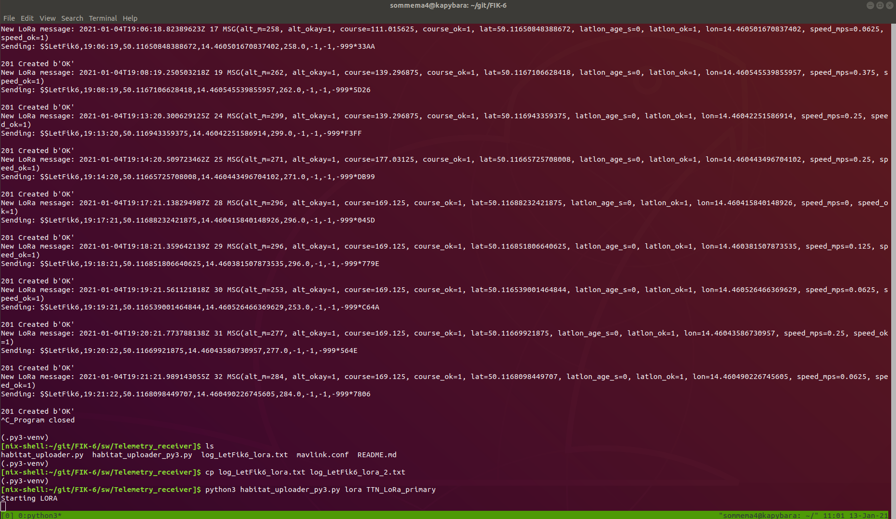

# habhub telemetry logging and uploading tool

The python script which receive telemetry packets from radio modem on serial port. The all received data are logged for forensic search.
Recognised telemetry packets are processed parsed an uploaded to http://habhub.org/ which allows instantaneous tracking of the ballon flight on https://tracker.habhub.org/ tracker map.

## The use

### Prerequisities

The software needs [Pynmea2](https://github.com/Knio/pynmea2) library which could be installed by following command:

    pip install pymavlink crc16 serial ttn

For usage with QGC parallelly, you must install [Mavlink-routered](https://github.com/intel/mavlink-router)

### Program launch

The software needs a hardware radio modem.  The modem is accessed trought an serial port "/dev/ttyUSB0" for example. Then the code could be executed by runnig following command:

    python habitat_uploader.py /dev/ttyUSB0 rover_calsign

### Program launch TTN

The software needs acces to [TTN LoRa application](https://www.thethingsnetwork.org/docs/applications/). Then the code could be executed by runnig following command:

    python3 habitat_uploader_py3.py lora TTN_LoRa_primary

The application hashes should be updated in the code. The script usually runs under screen or tmux on some server which is uptime during the balloon flight.

### Program launch with QGC (Mavlink UDP)

    mavlink-routered -c mavlink.conf

    pythton python habitat_uploader.py udpin:0.0.0.0:11000 rover_calsign

### Callsign setting

In order to properly display data in HabHub Tracker, the callsign variable in the script must be set to the same value as was earlier configured on Habitat's [Genpayload](http://habitat.habhub.org/genpayload/) webpage. In case the callsign need to be changed, go to Genpayload webpage and under "payload configuration documents" click "start from existing". Then search for the name of your payload (curently set to "LetFik5") and open the latest version of the document (it should be the most bottom one). There under "Parser configuration" choose "edit" and change "Callsign" field to the new value. Don't forget to save this configuration and then also the whole document. Now just simply change the callsign variable in the script to the same value as configured and from now on data should be uploaded and interpreted under new callsign. Note that you don't need to change callsign in order to change the name of the payload.
